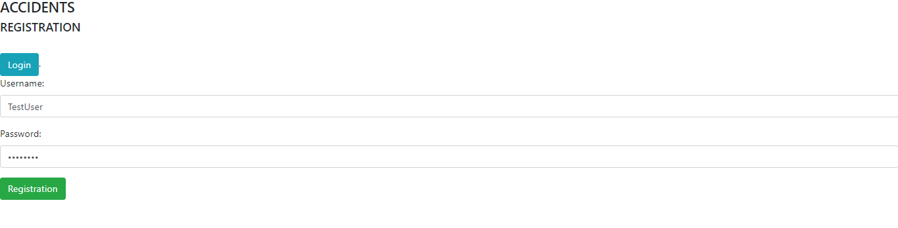
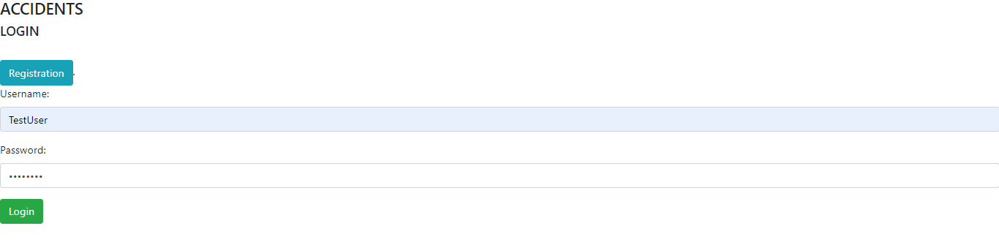
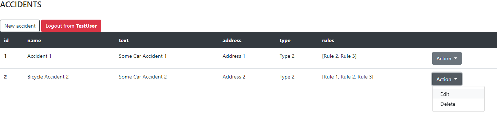
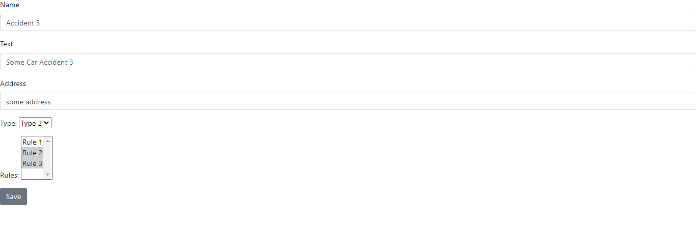

#car_accident
Проект - Автонарушители.
В системе существуют две роли. Обычные пользователи и автоинспекторы.
Пользователь добавляет описание автонарушение.
В заявлении указывает: адрес, номер машины, описание нарушения и фотографию нарушения.

◉ Java 11
◉ Apache Tomcat
◉ Spring Data JPA
◉ Spring Security
◉ PostgreSQL
◉ Maven

Вначале пользователю предлагается зарегистрироваться:

Или авторизироваться, если он уже имеет учетныю запись:

После авторизации пользователь получает доступ к списку нарушений. Он может либо создать новое нарушение, либо воспользовать Action панелью, в которой можно удалить или отредактировать уже существующую запись.

При создании новой записи нужно указать её название, текст, адресс, тип и нарушенные правила.

